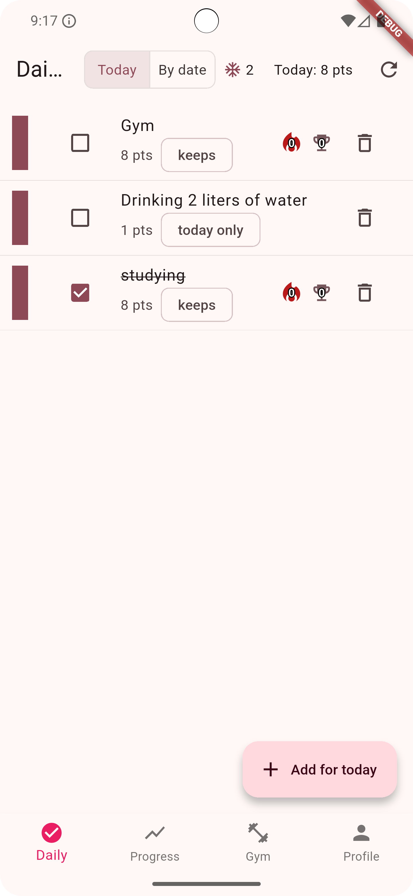
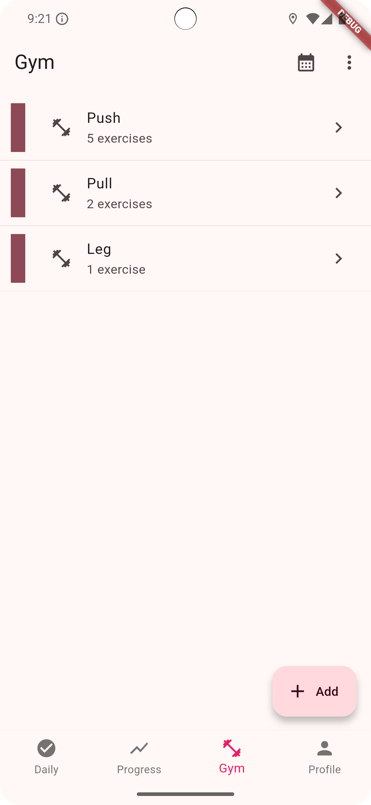
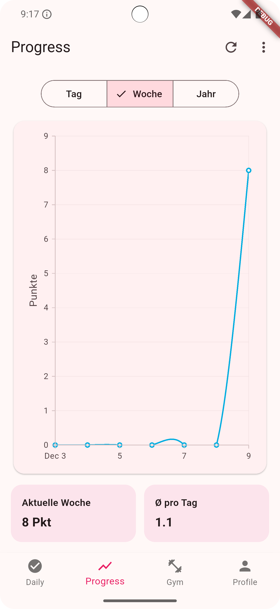
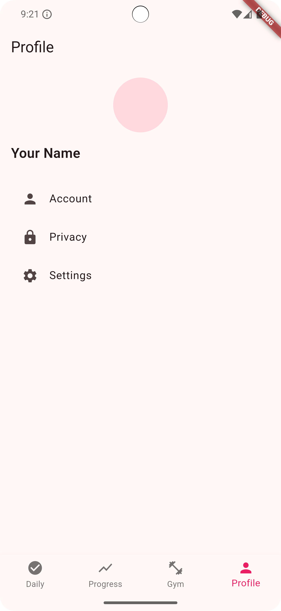

# Goalify

**Goalify** is a habit and gym tracking app that helps you stay productive and motivated. You can manage your daily to-do list, visualize your overall progress, and log your training weights at the gym. Weight progression can also be tracked and visualized per workout exercise, giving you a clear picture of when it’s time to increase the load.

---

## Motivation

I started building Goalify because I realized I was losing track of my weight progression in the gym. At the same time, I had been keeping a daily to-do list on a simple whiteboard. To make my everyday life easier and bring both worlds together, productivity and fitness.I decided to create this project and turn it into an app.

---

## Features

### Daily Tasks
- Reorder tasks via drag & drop
- Check off tasks and earn points
- **Streaks** with **Best Streak** tracking
- **Freeze tokens**: start with 2; earn +1 every 7 days; protect a streak on off days
- Midnight rollover:
  - “Keep” tasks are unchecked daily
  - “Today-only” tasks are removed
- Long-press actions: **Edit**, **Duplicate**, **Move to top**, **Reset streak(s)**, **Delete**
- Persistent custom order  
  (done items sink to bottom; unchecking restores original position)

### Gym Tracking
- Two views: **By Exercise** and **By Workout Day**
- Assign exercises to workout days (Push/Pull/Leg/…)
- Reorder exercises globally and within each day
- Log **weight**, **sets**, and **dropset** flag
- Full **history** dialog per exercise
- Interactive **progress chart** (date ↔ weight):
  - Tooltips with **date** (line 1) and **weight + kg** (line 2)
  - First & latest dates labeled on the x-axis
  - Adaptive y-axis with padding & clean grid (avoids banding for large ranges)
  - Dropset entries visually highlighted

### Progress Visulation
- KPI cards (e.g., Today’s points, trends)
---

## ❗ What’s NOT in (for now)

The **Groups** feature has been **removed** from the current build.  
It’s **under consideration** to return in the future.

---

## Screenshots

| Daily | Gym | Progress | Profile |
|------|-----|----------|-------------|
|  |  |  | |

---

## Project Structure

```
goalify/
├── frontend/   # Flutter app (Dart)
└── backend/    # FastAPI service (Python) - see backend/README.md
```

Flutter commands run from `frontend/`, Python commands from `backend/`.

---

## Tech Stack

### Frontend
- **Flutter** (Dart)
- Charts: **fl_chart**
- Storage: local JSON via a small `LocalStorage` helper (the app runs fully offline)
- State: straightforward `setState` + services

### Backend
- **FastAPI** (Python 3.12+), async **SQLAlchemy 2.0** + **Alembic**
- SQLite locally, PostgreSQL for deployments
- JWT auth with rotating refresh tokens

> Previously listed: Riverpod and Firebase/Auth/Firestore, those are **not required** in the current app and are **planned/optional**.

---

## Installation

### Requirements

- **Flutter** installed (see https://flutter.dev/docs/get-started/install)
- **Python 3.12+** for the backend

### Clone

```bash
git clone https://github.com/Richard-Kruschinski/goalify.git
cd goalify/frontend
flutter pub get
```

### Run the app
```bash
cd frontend
flutter run
```

### Run the backend
```bash
cd backend
python -m venv .venv
.venv\Scripts\activate          # Windows
pip install -r requirements-dev.txt
copy .env.example .env
uvicorn app.main:app --reload
```

Details in [backend/README.md](backend/README.md).
